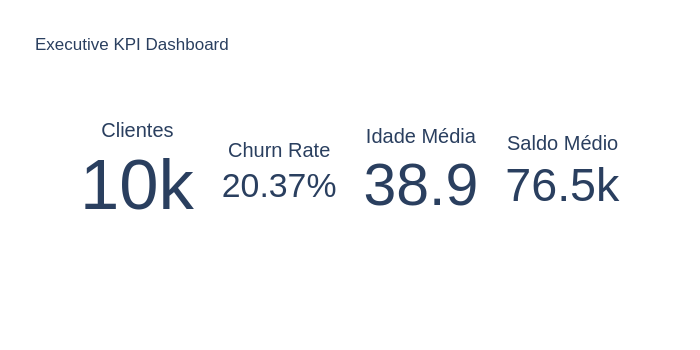
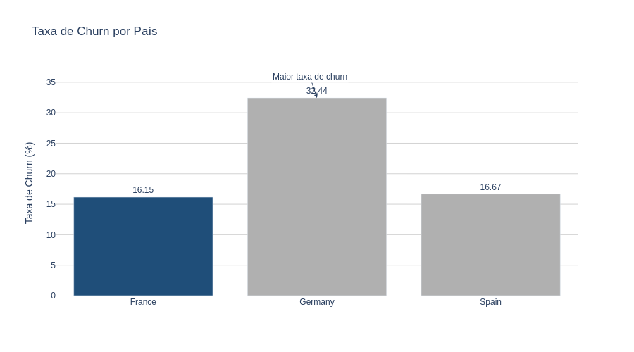
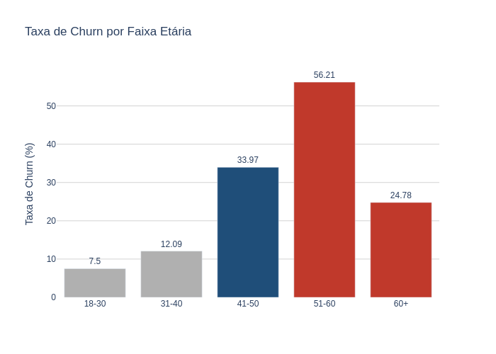
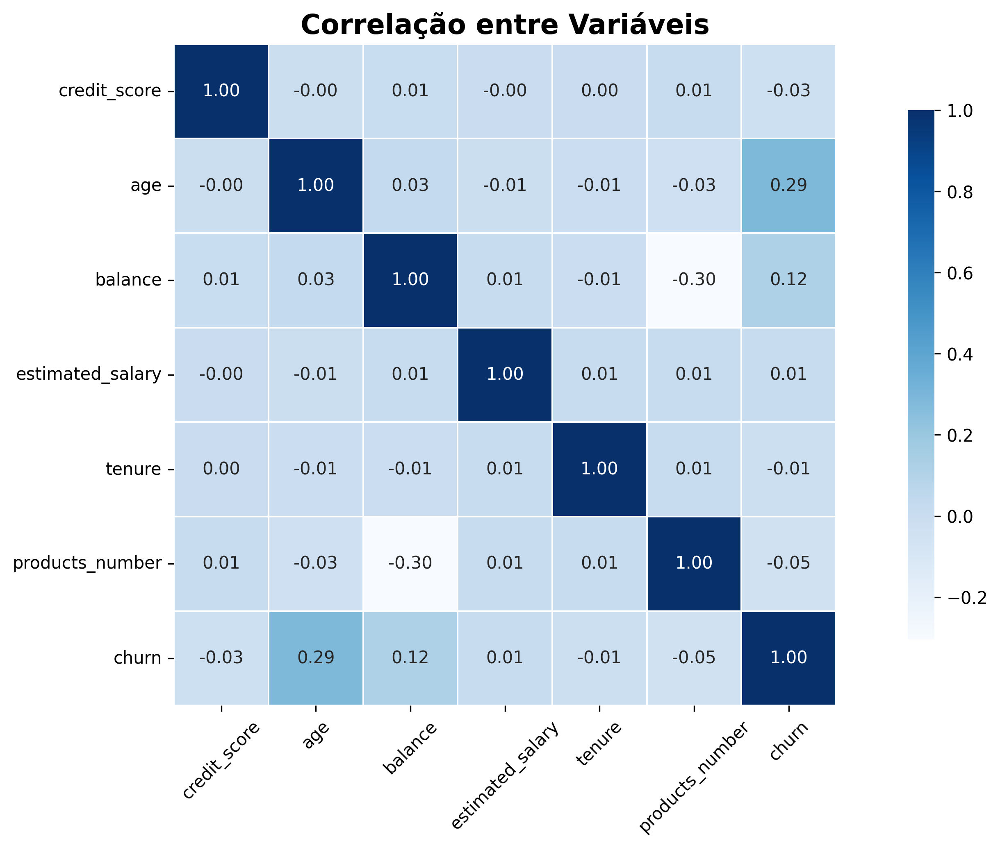
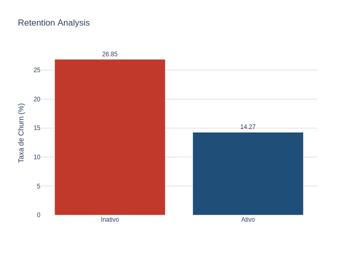

# Bank Customer Analytics & Churn Intelligence

Projeto analítico experimental desenvolvido durante meus estudos em Data Science, utilizando conceitos de Analytics Engineering para explorar análise de churn bancário, visualização executiva de dados e storytelling analítico com Python, Plotly, Pandas e SQL Analytics.

O projeto foi criado com o objetivo de aproximar a análise de dados de um cenário corporativo real, explorando métricas de negócio, segmentação de clientes e visualizações orientadas à tomada de decisão.

---

# Objetivo do Projeto

O objetivo principal deste projeto é analisar padrões relacionados ao churn de clientes bancários, identificando fatores que podem impactar retenção, comportamento financeiro e risco de evasão.

A proposta do projeto foi desenvolver uma análise mais estruturada e próxima de um ambiente corporativo, aplicando conceitos utilizados em Analytics Engineering, Business Intelligence e Data Analytics.

---

# Tecnologias Utilizadas

- Python
- Pandas
- NumPy
- Plotly
- Seaborn
- Matplotlib
- DuckDB
- SQL
- Google Colab
- GitHub

---

# Estrutura Analítica do Projeto

O projeto foi dividido em etapas utilizadas em fluxos analíticos modernos:

## Data Ingestion
- carregamento e leitura do dataset bancário.

## Data Quality
- verificação de valores nulos;
- análise de duplicados;
- validação de tipos de dados;
- consistência das colunas.

## Feature Engineering
Criação de variáveis analíticas como:
- faixa etária;
- segmentação salarial;
- agrupamentos de clientes.

## KPI Layer
Construção de métricas estratégicas:
- taxa de churn;
- saldo médio;
- score médio;
- clientes ativos;
- métricas executivas.

## SQL Analytics
Utilização de SQL com DuckDB diretamente nos DataFrames para consultas analíticas e agregações.

## Executive Visualization
Desenvolvimento de dashboards e gráficos executivos utilizando:
- storytelling visual;
- cores intencionais;
- direct labeling;
- destaque analítico;
- redução de ruído visual.

---

# Principais Análises Realizadas

- Taxa de churn por país;
- Churn por faixa etária;
- Retenção de clientes;
- Correlação entre variáveis financeiras;
- Segmentação analítica;
- Dashboard executivo de KPIs.

---

# Executive KPI Dashboard

---

# Churn por País

---

# Churn por Faixa Etária

---

# Heatmap de Correlação

---

# Retention Analysis

---

# Principais Insights

- Clientes acima de 50 anos apresentaram maior taxa de churn;
- Clientes inativos possuem maior tendência de evasão;
- Alguns segmentos financeiros demonstraram maior risco de cancelamento;
- O comportamento do churn apresentou relação com fatores financeiros e demográficos.

---

# Storytelling e Visualização Analítica

O projeto foi desenvolvido aplicando conceitos modernos de visualização de dados e comunicação analítica:

- direct labeling;
- hierarquia visual;
- cores intencionais;
- dashboards executivos;
- destaque visual de métricas;
- redução de carga cognitiva;
- foco em leitura executiva.

O objetivo foi transformar dados em insights mais claros para tomada de decisão.

---

# Uso de IA no Processo

Durante o desenvolvimento do projeto utilizei IA como apoio técnico e educacional para:

- compreender conceitos mais avançados de visualização analítica;
- melhorar a estrutura das análises;
- realizar debugging;
- aprofundar conhecimentos em SQL Analytics;
- entender práticas utilizadas em projetos corporativos;
- acelerar o processo de aprendizado em Data Science e Analytics.

A IA foi utilizada como ferramenta de apoio ao desenvolvimento e aprendizado ao longo do projeto.

---

# Próximos Passos

Melhorias futuras planejadas:

- criação de dashboard interativo completo;
- integração com Power BI;
- pipeline ETL mais robusto;
- modelagem preditiva de churn;
- automação de métricas;
- evolução da camada analítica.

---

# Autor

Hewerson

Estudante de Data Science, visualização de dados, storytelling analítico e projetos orientados a negócio.
